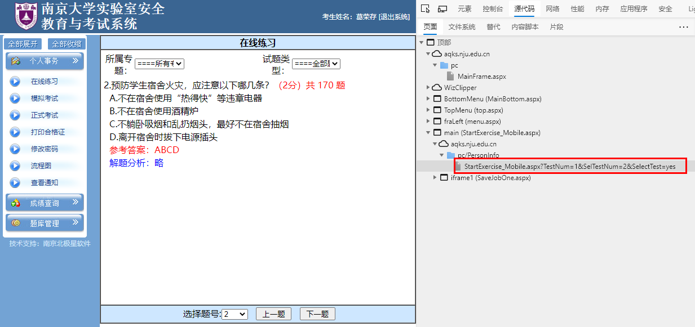
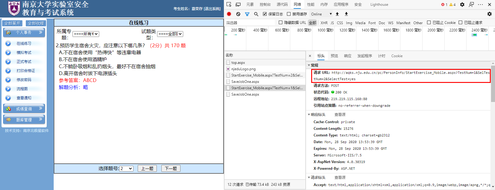

**摘要：** 记录爬虫过程中遇到的问题

# aspx页面url不变

面临的第一个问题就是aspx页面url不变。每道题应该对应不同的url。

可以查看源代码

或者查看标头

# 题库中题目混乱

第一次爬虫时，爬取得到的题库中题目混乱。一开始认为url“http://aqks.nju.edu.cn/pc/PersonInfo/StartExercise_Mobile.aspx?TestNum=1&SelTestNum=2&SelectTest=yes”中的SelTestNum表示题目序号，TestNum表示题目种类（防火安全与保密、化学危险品使用安全、用电安全、通识类）。但是检查之后，再发现，TestNum这个变量不表示题目种类。

既然，TestNum不表示题目种类，只有SelTestNum题号信息，无法区分不同题目种类的相同题号题目。

解决方法：

在网站中，手动切换题目种类：

运行Python爬虫脚本，获得该题目种类的所有题目。

再手动切换题目种类，运行Python爬虫脚本，以此类推。