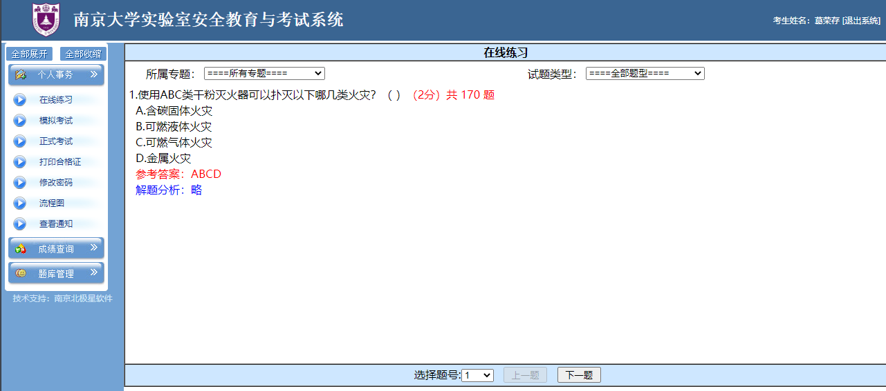

**南京大学实验室安全教育与考试系统题库**

# 摘要

本项目使用Python爬取了“南京大学实验室安全教育与考试系统”的所有题目，并制作成题库，方便学习以及在考试中查阅。

# 缘由

2020年9月25日，学校和学院要求进入实验室做实验同学在“南京大学实验室安全教育与考试系统”学习并参与考试。成绩达到80分以上，才能合格。为了考到满意成绩，使用Python语言爬取了所有题目，并制作成题库，方便在考试中快速查阅。

网站主页截图：

本项目的目的有二，一是分享题库，方便大家查阅；二是在爬虫过程中，遇到了一些困难，记录在此，方便以后查阅。

# 目录结构

**QuestionBank**

南京大学实验室安全教育与考试系统**题库**，包含防火安全与保密（共 170 题）、化学危险品使用安全（共 1040 题）、用电安全（共 206 题）、通识类（共 350 题）等四类题目，包括md、docx、pdf三种文件格式。

**PythonCrawler**

爬虫脚本和爬虫教程。